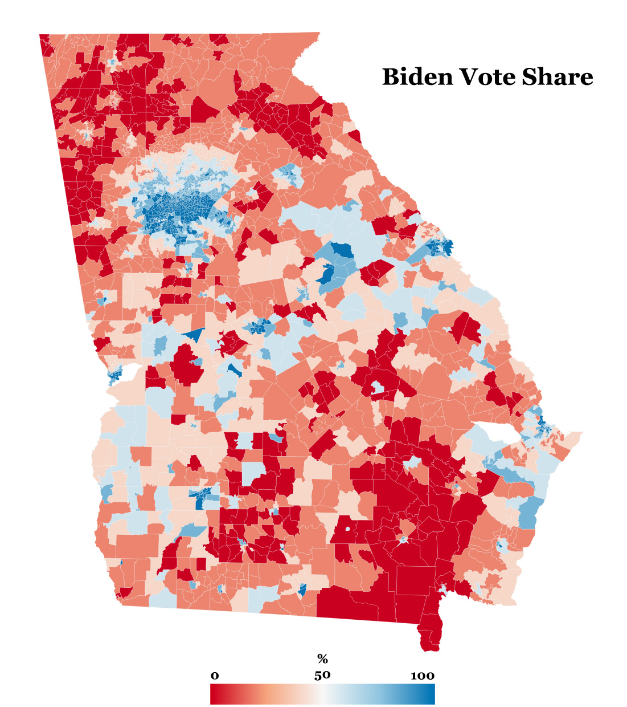

# GA-Election-Data-2020
Collection of datasets and analysis from Georgia's 2020 General Election Results

## Repository File Contents
**GA_GenElecRes2020_precinct_wACS.geojson**

GeoJSON file of Georgia's 2020 general election voting precints (n=2683). Boundaries were obtained from: 

*Voting and Election Science Team, 2020, "2020 Precinct Shapefiles", https://doi.org/10.7910/DVN/XPW7T7, Harvard Dataverse, V5*

It also contains precinct-level election results from the 2020 general election for the presidential and senate races, expressed in terms of total votes for each candidate broken down by voting method.

There are also 31 socioeconomic variables derived from the 2014-2018 American Community Survey (ACS) obtained from [NHGIS](https://www.nhgis.org/). Using 2018 TIGER/Line+ Georgia block group boundaries (n=5528), area-weighted-average values block group level ACS variables were calculated for each precinct boundary. 

**NOTE:** These ACS values do NOT represent the exact characteristics of 2020 election voters, but rather estimated charcteristics of residents living within precincts according to the 2014-2018 ACS.

**metadata.csv**

Descriptions of all attribute fields found in GA_GenElecRes2020_precinct_wACS.geojson

