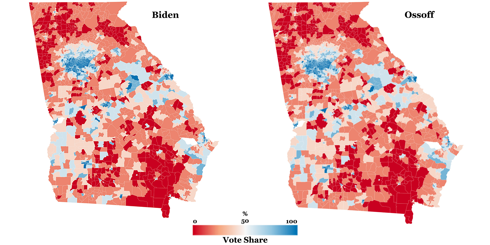
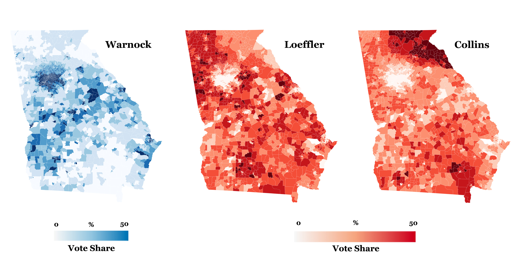

# GA-Election-Data-2020
Collection of datasets and analysis from Georgia's 2020 General Election

## Contents (/data folder)
**GA_GenElecRes2020_precinct_wACS**  
Available both as a CSV (no spatial geometry) and as a spatial GeoJSON file (stored in .zip file) of Georgia's 2020 general election voting precints (n=2683). Boundary geometries represented in the GeoJSON were obtained from: 

*Voting and Election Science Team, 2020, "2020 Precinct Shapefiles", https://doi.org/10.7910/DVN/XPW7T7, Harvard Dataverse, V5*

It also contains precinct-level election results from the 2020 general election for the presidential and senate races, expressed in terms of total votes for each candidate broken down by voting method. These results were obtained from the [Georgia Secretary of State](https://results.enr.clarityelections.com/GA/105369/web.264614/#/access-to-races).

There are also 31 socioeconomic variables derived from the 2014-2018 American Community Survey (ACS) obtained from [NHGIS](https://www.nhgis.org/). Using 2018 TIGER/Line+ Georgia block group boundaries (n=5528), area-weighted-average values block group level ACS variables were calculated for each precinct boundary. 

**NOTE:** These ACS values do NOT represent the exact characteristics of 2020 election voters, but rather estimated charcteristics of residents living within precincts according to the 2014-2018 ACS. 

Included variables are:
* Total Population
* Voting Age Population (18 or older)
* No. Households
* Fraction Male
* Fraction Female
* Median Age (Total Pop.)
* Median Male Age (Total Pop.)
* Median Female Age (Total Pop.)
* Mean Age (Total Pop.)
* Mean Age (Voting Pop.)
* Mean Male Age (Total Pop.)
* Mean Female Age (Total Pop.)
* Mean Male Age (Voting Pop.)
* Mean Female Age (Voting Pop.)
* Fraction White
* Fraction Non-White
* Fraction Black
* Fraction American-Indian
* Fraction Asian
* Fraction Hispanic
* Fraction Non-White Hispanic
* Mean Travel Time to Work [mins]
* Mean Years of Education
* Mean Ratio of Income to Federal Poverty Line
* Median Household Income [$]
* Fraction Employed
* Fraction Unemployed
* Fraction Homeowners
* Fraction Renters
* Median Rent [$]
* Fraction Without Health Insurance   

**metadata.csv**  
Descriptions of all attribute fields found in GA_GenElecRes2020_precinct_wACS.geojson   

## Election Results Examples

   

## ACS Variable Examples

