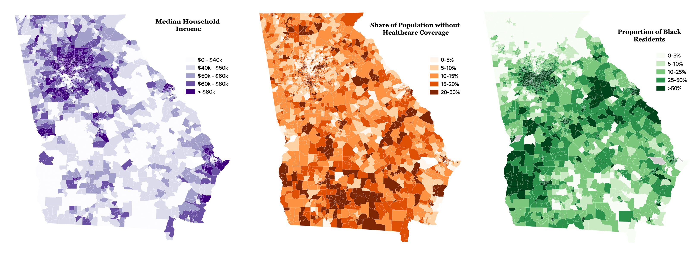
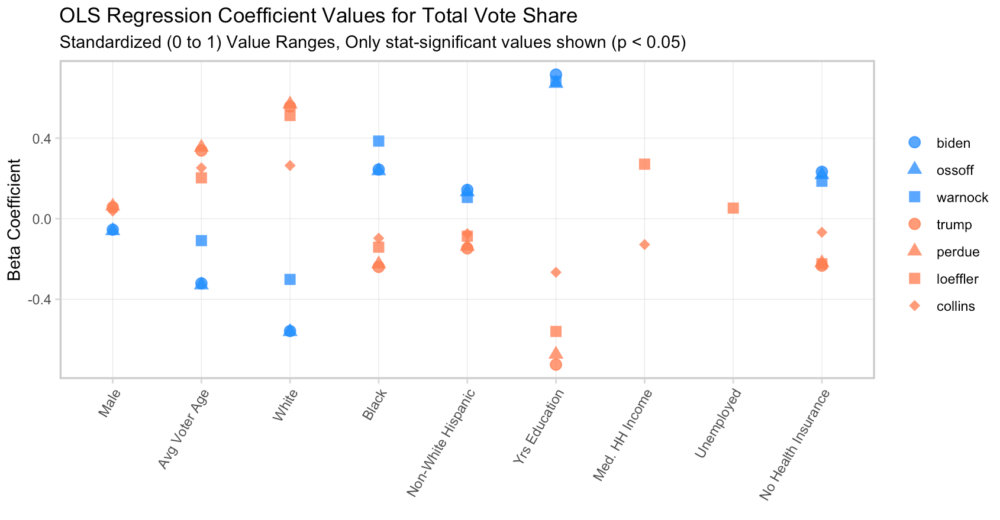
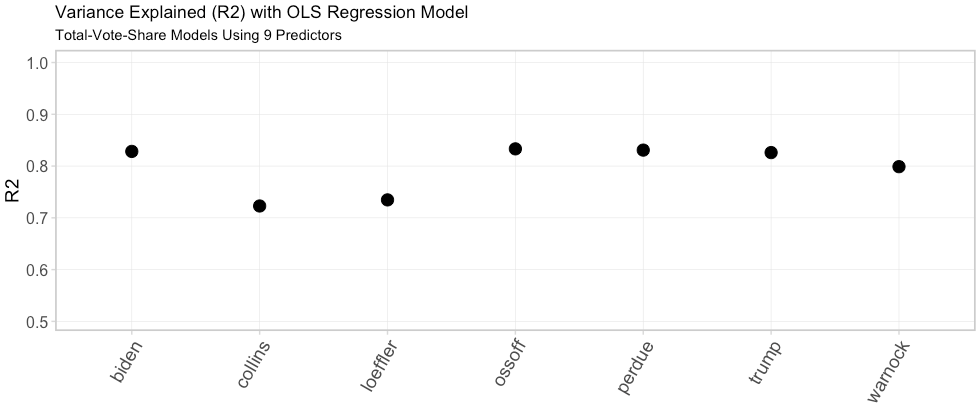

# GA-Election-Data-2020
Collection of datasets and analysis from Georgia's 2020 General Election

## Election Results Examples

   

## Contents 
#### (/data folder)
**GA_GenElecRes2020_precinct_wACS**  
Available both as a CSV (no spatial geometry) and as a spatial GeoJSON file (stored in .zip file) of Georgia's 2020 general election voting precints (n=2683). Boundary geometries represented in the GeoJSON were obtained from: 

*Voting and Election Science Team, 2020, "2020 Precinct Shapefiles", https://doi.org/10.7910/DVN/XPW7T7, Harvard Dataverse, V5*

It also contains complete precinct-level election results from the November 3, 2020 general election for the presidential and senate races, expressed in terms of total votes for each candidate broken down by voting method. These results were obtained from the [Georgia Secretary of State (SoS)](https://results.enr.clarityelections.com/GA/105369/web.264614/#/access-to-races).

There are also 31 socioeconomic variables derived from the 2014-2018 American Community Survey (ACS) obtained from [NHGIS](https://www.nhgis.org/). Using 2018 TIGER/Line+ Georgia block group boundaries (n=5528), area-weighted-average values block group level ACS variables were calculated for each precinct boundary. 

**NOTE:** These ACS values do NOT represent the exact characteristics of 2020 election voters, but rather estimated charcteristics of residents living within precincts according to the 2014-2018 ACS. 

Included ACS variables are:
* Fraction Male
* Fraction Female
* Median Age (Total Pop.)
* Median Male Age (Total Pop.)
* Median Female Age (Total Pop.)
* Mean Age (Total Pop.)
* Mean Age (Voting Pop.)
* Mean Male Age (Total Pop.)
* Mean Female Age (Total Pop.)
* Mean Male Age (Voting Pop.)
* Mean Female Age (Voting Pop.)
* Fraction White
* Fraction Non-White
* Fraction Black
* Fraction American-Indian
* Fraction Asian
* Fraction Hispanic
* Fraction Non-White Hispanic
* Mean Travel Time to Work [mins]
* Mean Years of Education
* Mean Ratio of Income to Federal Poverty Line
* Median Household Income [$]
* Fraction Employed
* Fraction Unemployed
* Fraction Homeowners
* Fraction Renters
* Median Rent [$]
* Fraction Without Health Insurance   

**metadata.csv**  
Descriptions of all attribute fields found in GA_GenElecRes2020_precinct_wACS   

## ACS Variable Examples
   

## Known Data Issues 
* Voter turnout: Registered voter totals are not reported (are entered as 0 values on SoS webpage) for 76 precints in the following counties:
    * Bleckley (1 precinct)
    * Chatham (1/92 precincts)
    * Chattahoochee (1 precinct)
    * Hall (31 precincts)
    * Jones (10 precincts)
    * Pike (8 precincts)
    * Screven (12 precincts)
    * Stephens (1 precinct)
    * Toombs (5 precincts)
    * Treutlen (2 precincts)
    * Wheeler (2 precincts)  

    Voter turnout values for these precincts are reported as NA.

* 27/2683 precincts in the Harvard Dataverse GA-precinct shapefile do not have corresponding election results report by the SoS. 20 of these are located in Fulton County. The remaining 7 do not contain any county or precinct identifier information in the Harvard Dataverse file and therfore couldn't be mapped to election results. All 27 of these look to be predominantly unpopulated/non-residential/open space areas.

* Some block groups in the ACS dataset obtained lacked data for certain variables. If some portion of a precinct area lacked overlapping block group values, that area was excluded from the precinct's final area-weighted-average value. However, 2 precincts had no overlapping block group data for median household income and 49 precincts lacked data for median rent. These missing values are reported as NA.

  

## Assessing Significant ACS-variable Predictors of Candidate Preference 
### Simple Ordinary Least Squares (OLS) Linear Regression 
Positive beta coefficient values indicate positive correlations between that variable and a tendency to favor a given candidate. Negative values imply the inverse.  

  

The fraction of observed, precinct-level variance in candidate preference that is explained by a simple 9-variable OLS model. R2 of 1.0 = 100%, R2 of 0.0 = 0%.  

